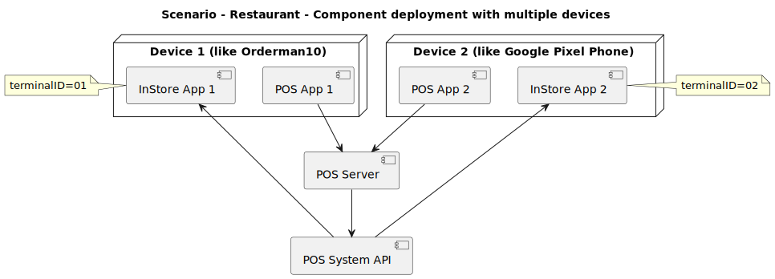
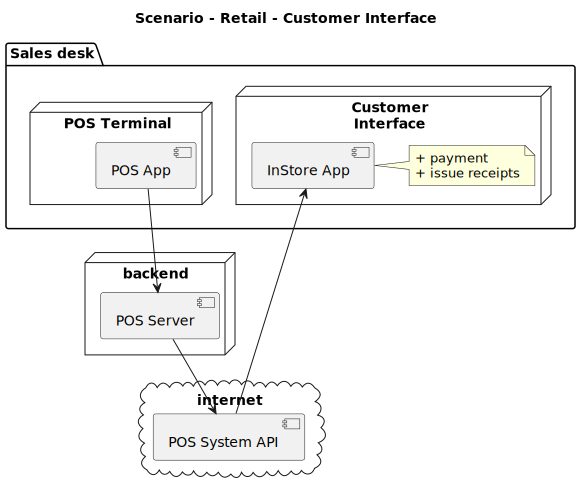
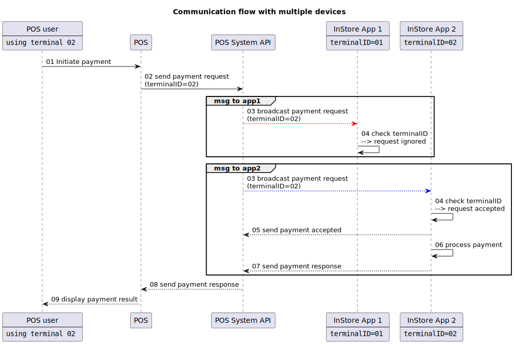
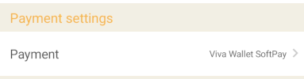
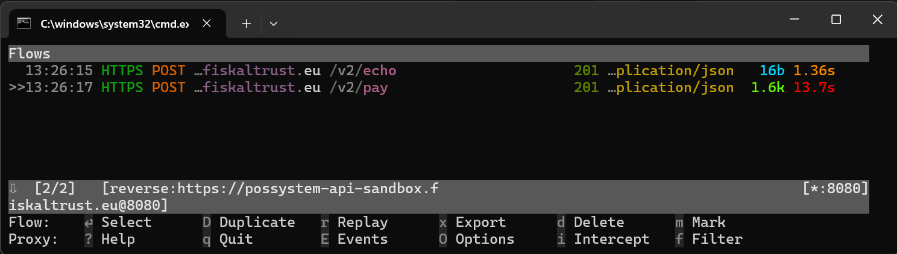

# fiskaltrust POS System API - Development Kit

## Table of Contents

- [Introduction](#introduction)
  - [Running the How-To's](#running-the-howtos)
  - [Before You Continue - Try It Out](#before-you-continue---try-it-out)
- [Architecture and Handling of Multi-Terminal Setups](#architecture-and-handling-of-multi-terminal-setups)
  - [Component Deployment](#component-deployment)
  - [Payment Communication Flow – terminalID-Based Routing and Filtering](#payment-communication-flow---terminalid-based-routingfiltering)
  - [Payment Communication Flow - protocol-Based Routing and Filtering](#payment-communication-flow---protocol-based-routingfiltering)
- [Debugging the Communication](#debugging-the-communication)
- [Related Links](#useful-followup-links)

---

## Introduction

This guide focuses on running samples using the **fiskaltrust InStore App** and the **POS System API** to help you quickly become familiar with them.

**NOTE:** At this time, the scope is limited to integrations related to the **InStore App** and the **Payment API**.

### Running the How-To's

Currently, How-To's are provided in C# only. To run them, review the following:

**Prerequisites**
- Install the `.NET 9` runtime and SDK.
- Review the README in the How-To that you want to use for any additional prerequisites.
- (Optional) Use Visual Studio or Visual Studio Code for easier project and solution handling.

**Using Visual Studio**
- Open the solution file of the How-To that you want and run it.

**Using Visual Studio Code (VS Code)**
- The VS Code debug configuration should already be set up.
- Then, choose the How-To to debug from the debug target dropdown in the "Run and debug" view.

**Using the Command Line (alternatively)**
- Open a terminal and navigate to the How-To directory that you want to run.
- Execute the following command: `dotnet run`.

### Installing and Configuring the InStore App

Install and configure the InStore App as follows:

- [Install](https://docs.fiskaltrust.eu/docs/poscreators/middleware-doc/instore-app/installation-guides) **InStore App** and connect it to a CashBox via your **fiskaltrust** sandbox portal.
- The How-To's use the following environment variables for configuration, which are read via the `libPosSystemAPI` (as further explained in [HOWTO_01_Payment](HOWTO_01_Payment_csharp/README.MD)):
  - `FISKALTRUST_CASHBOX_ID`: found in your **fiskaltrust** portal when configuring the CashBox.
  - `FISKALTRUST_CASHBOX_ACCESS_TOKEN`: found in your **fiskaltrust** portal when configuring the CashBox.
  - `FISKALTRUST_POS_SYSTEM_API_URL`: the default value is `https://possystem-api-sandbox.fiskaltrust.eu/v2`.
  - `FISKALTRUST_POS_SYSTEM_ID`: required for production use. For production usage and release testing, you must use a valid POS System ID issued by **fiskaltrust**. You can obtain this ID by adding/registering a POS System in the **fiskaltrust** portal. For more information about the POS System registration, see [PosDealer Onboarding](https://docs.fiskaltrust.eu/docs/poscreators/get-started#3-posdealer-onboarding).
- [Configure](https://docs.fiskaltrust.eu/docs/poscreators/middleware-doc/instore-app/available-settings#payment-settings) a payment provider.

#### Using the Dummy Payment Provider for Simplified Integration (InStore App Developer Mode)

**IMPORTANT**: This feature is available with InStore App v1.2.8-rc1 and later.

The InStore App supports a developer mode. When enabled, a hidden **Dummy Payment Provider** can be configured, allowing easy integration and testing of different payment success and error scenarios without requiring access to a real payment provider. To enable the developer mode in the InStore App, complete the following steps:

1. Start the InStore App and navigate to the home screen.
2. At the bottom of the screen, tap the **fiskaltrust** logo five times to open the Developer Mode PIN entry dialog.
3. Enter the PIN: `4242`.
4. If successful, an information dialog will appear confirming that Developer Mode is enabled. Tap OK to close the dialog; the app will then exit automatically.

**Configuring the Dummy Payment Provider**

1. Restart the InStore App.
2. Open **Settings** and navigate to the **Payment settings** section.
3. Tap on **Payment entry** (the first item in **Payment Settings**) and select the **Dummy Payment Provider**, which is now visible because the developer mode is active.

**Using the Dummy Payment Provider**

When executing a payment action with the `use_auto` or `test` protocol, payments will be processed by the Dummy Payment Provider, which is visible via the payment progress screen that appears when starting a payment action.

Any payment amount will return a SUCCESS response, except for the following defined special amounts:

| **Payment request** | **Result**      |
|---------------------|-----------------|
| 30000,10 | DECLINED |
| 30000,20 | TIMEOUT (returned as an error message as no other option is available yet) |
| 30000,40 | CANCELLED BY USER |
| 30000,50 | SUCCESS with added guest tip |
| 30000,60 | SUCCESS after 1-minute delay |
| 30000,70 | SUCCESS after 3-minute delay |
| 30000,80 | SUCCESS after 6-minute delay |
| 30000,90 | SUCCESS, but only 15000,50 will be approved |

### Before You Continue – Try It Out

As a first step, review the [HOWTO_01_Payment](HOWTO_01_Payment_csharp/README.MD) to complete the initial setup. Once your setup is working, continue here to gain a deeper understanding and explore the other How-To's.

## Architecture and Handling of Multi-Terminal Setups

**Scenario**: A typical restaurant workflow in which the POS user operates a mobile device running both the POS app and the InStore App.

### Component Deployment

Below are two common scenarios for the InStore App. While other configurations are possible, these examples represent typical setups.

#### Restaurant - Mobile Ordering Scenario

When using two devices, the setup might be structured as follows:

#### Retail - Customer Receipt Scenario

In this scenario, the InStore App is installed on a separate Android device positioned next to the POS.

### Payment Communication Flow – terminalID-Based Routing and Filtering

When using multiple devices, [configure](https://docs.fiskaltrust.eu/docs/poscreators/middleware-doc/instore-app/available-settings#terminal-id-filter) the `terminalID` in the InStore App settings so that each device uses its own unique `terminalID` in the connected CashBox, as follows:

When executing requests from the POS, it is essential to use the `terminalID` to ensure that each request is routed to the correct target system. 

**Example:** A waiter uses an Android smartphone (terminal 02) running the POS app, with the InStore App installed. When a payment transaction is triggered, the request is routed specifically to the InStore App instance associated with terminal 02.

### Payment Communication flow - protocol-Based Routing and Filtering

In addition to the terminalID, payment requests are also routed and filtered based on the protocol specified in the request. The protocol corresponds to the [payment vendor configured](https://docs.fiskaltrust.eu/docs/poscreators/middleware-doc/instore-app/available-settings#payment-settings) on the target device in the InStore App settings.

**Example:** Using **Viva Wallet SoftPay** maps to the protocol `viva_eft_pos_instore`:

Review the following **message routing rules**:

- `protocol == use_auto`: If any payment vendor is configured, the request gets accepted.
- `protocol == specific protocol` (e.g.,`viva_eft_pos_instore`): The request is only accepted if the payment vendor that supports this protocol is configured (in this example, **Viva Wallet SoftPay**).

## Debugging the Communication

It is recommended to use [mitmproxy](https://www.mitmproxy.org/) as an intermediary between your solution and the POS System API to inspect all requests and responses exchanged between them. For this, complete the following:

- Refer to [mitmproxy.bat](mitmproxy.bat) for instructions on how to run it.
- Set the `FISKALTRUST_POS_SYSTEM_API_URL` environment variable as described in [HOWTO_01_Payment](HOWTO_01_Payment_csharp/README.MD) to `http://localhost:8080/v2`, which is the address the mitmproxy listens when using the batch file to start it.

With this setup, all requests from the How-To's are routed through mitmproxy, where they can be inspected. mitmproxy then forwards the requests to the POS System API as configured in the batch file.

## Related Links

- [POS System API documentation](https://docs.fiskaltrust.cloud/apis/pos-system-api)
  - [Pay requests](https://docs.fiskaltrust.cloud/apis/pos-system-api#tag/pay)
- [InStore App](https://docs.fiskaltrust.cloud/docs/poscreators/middleware-doc/instore-app/introduction)
  - [Installing the InStore App](https://docs.fiskaltrust.cloud/docs/poscreators/middleware-doc/instore-app/installation-guides) on your device
  - [Setting up the InStore App](https://docs.fiskaltrust.cloud/docs/poscreators/middleware-doc/instore-app/setup-guide) to work with your **fiskaltrust** environment
    - For development, it might be useful to use the [preview release](https://link.fiskaltrust.eu/downloads/instoreapp/preview) instead of the [stable release](https://link.fiskaltrust.eu/downloads/instoreapp/stable)
- Important reading to avoid setup errors
  - [Multi-terminal setup](https://docs.fiskaltrust.eu/docs/poscreators/middleware-doc/instore-app/multiterminal-settings) - Learn how to avoid duplicate transactions
